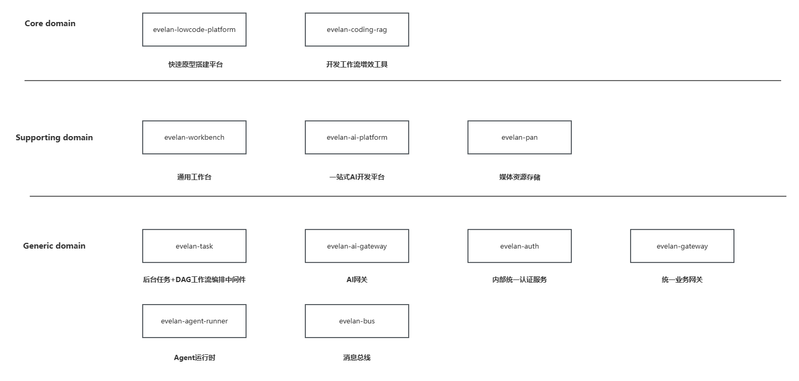
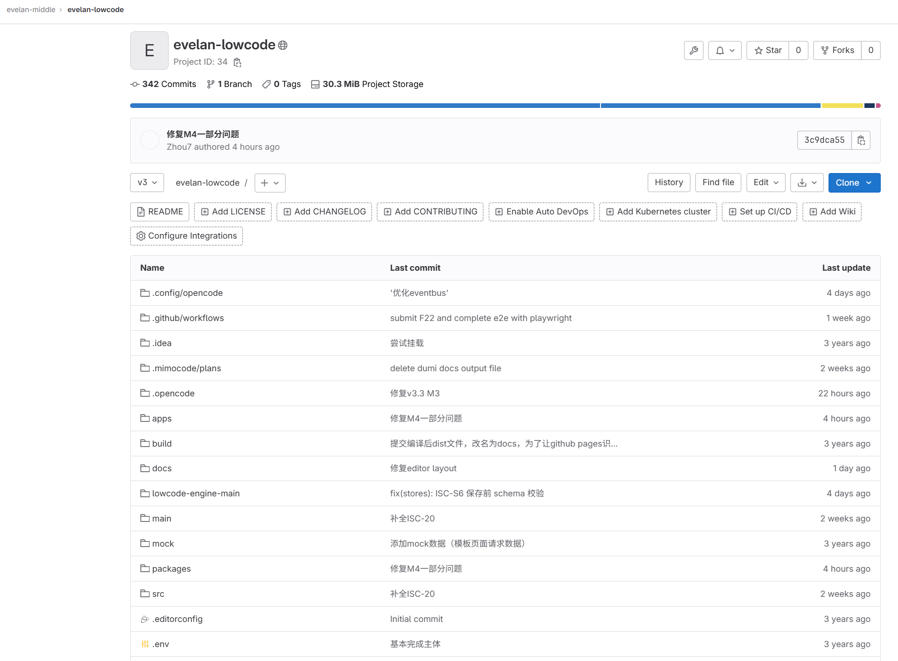
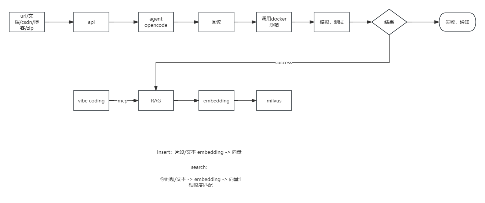
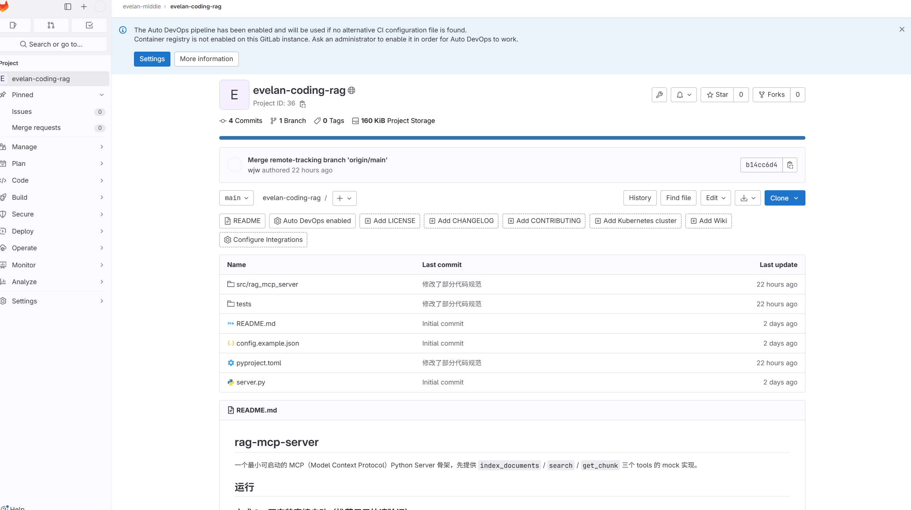
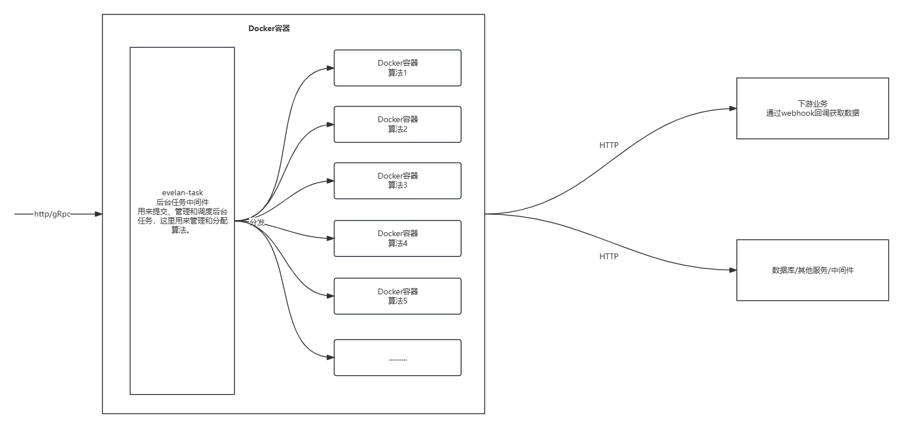
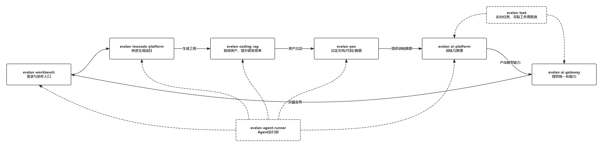

# Linklan 技术规划 Report
## 技术规划与演进报告 2026.07 ~ 2027.07

  From IIOT Digital Twin · To AI-Driven Fullstack Automation

---
layout: two-cols
---

# 远景规划（设想）

## 架构总览
按照 DDD 思想划分 LinkLan 未来架构

1. Core Domain（***最上层，直接形成商业价值与差异化能力***）
- 
承载核心业务、关键产品，支撑核心业务、直接商业产品，或者间接支撑直接商业产品的领域

2. Supporting Domain（***支持业务的领域***）
- 
不直接对外售卖，但支撑内部协作、流程推进与组织效率

3. Generic Domain（***最底层，用于通用支撑的领域***）
- 
作为基础设施与通用能力底座，强调可控、可复用、可定制

::right::

---
layout: section
---

# Core Domain
### 直接或简洁支撑LinkLan的核心业务

---
layout: two-cols-header
---

::left::

## 现状梳理

  

    
业务现实

    
公司当前业务主要为以下两类

    <ul class="text-sm leading-7 mt-2 opacity-90">
      <li>SOP 检测与视觉类交付</li>
      <li>软件服务开发</li>
    </ul>
  

  

    
核心判断

    

      在 SOP 检测场景中，算法是核心交付物。但检测界面、结果呈现、配置管理、数据联动等功能属于常规软件开发，同样决定了项目能否快速上线、稳定复用、持续扩展。
    

  

::right::

  

    
当前痛点

    <ul class="text-sm leading-7 mt-2 opacity-90">
      <li>每个sop项目的 UI “壳”都在重复手工搭建</li>
      <li>AI 临时生成页面，质量与可维护性不可控</li>
      <li>接口、流程、样式需要反复人工对齐</li>
    </ul>
  

  

    
Core Domain 目标

    <ol class="text-sm leading-7 mt-2 opacity-90">
      <li>沉淀一条可复用的 UI 交付流水线</li>
      <li>让 vibe coding 进入标准化、可审计、可维护的框架</li>
      <li>把交付经验沉淀为平台资产，而不是一次性项目代码</li>
    </ol>
  

---
layout: two-cols-header
transition: slide-up
---

# evelan-lowcode-platform
> 基于Agent和Lowcode的快速原型开发平台

::left::

  

    
平台定义

    

      面向 SOP 检测、非软件开发型业务和快速原型场景，提供一套可复用、可导出、可继续开发的业务生成平台。
    

  

  

    
当前定位

    <ul class="text-sm leading-7 mt-2 opacity-90">
      <li>快速原型平台：帮助需求澄清与方案验证</li>
      <li>SOP UI 支撑平台：覆盖检测、展示、配置管理</li>
      <li>MVP 输出平台：服务内部项目试错与业务验证</li>
      <li>嵌入式底座：为大屏及垂直业务提供统一外壳</li>
    </ul>
  

::right::

  

    
技术出口

    <ul class="text-sm leading-7 mt-2 opacity-90">
      <li>React 18 + TypeScript + Vite + TailwindCSS + Monorepo + Shadcn/UI @ai-sdk/openai</li>
      <li>可导出完整 Next.js 项目，并集成 Ant Design 交付界面</li>
      <li>本地部署支持 SQLite + 本地媒体存储，线上支持 Supabase</li>
      <li>支持 Electron 封装，交付为 exe 可执行程序</li>
    </ul>
  

  

    
能力边界

    

      平台不仅生成页面，还允许按脚本或 DAG 方式编排查询数据库、调用 API 与业务处理流程，并支持 Vercel 部署或源码导出。
    

  

--- 
layout: default
transition: slide-up
---

# lowcode + Agent

  

    不是让 AI 直接生成一堆不可控页面，而是把 AI 放进一个有约束、有组件边界、有工程出口的 lowcode 平台里，负责搭建、编排与交付。
  

  

    
传统平台优缺点

    <ul class="text-[13px] leading-6 mt-2">
      <li>强约束、可配置、易沉淀 Schema 与规则</li>
      <li>学习成本高，操作链路偏重</li>
      <li>多数停留在 H5 搭建，系统级输出不足</li>
      <li>AI 兴起后，单独作为入口竞争力变弱</li>
    </ul>
  

  

    
直接 Vibe Coding

    <ul class="text-[13px] leading-6 mt-2 opacity-90">
      <li>风格漂移，产品质感难统一</li>
      <li>代码常停留在 Demo 水平，隐患后置</li>
      <li>重复造轮子，维护成本持续上升</li>
      <li>缺乏统一约束，结果不可控</li>
    </ul>
  

  

    
开发目的

    <ul class="text-[13px] leading-6 mt-2 opacity-90">
      <li>用 AI 补齐传统 lowcode 的效率短板</li>
      <li>通过文档与 skill 约束 AI 的生成行为</li>
      <li>在可控前提下提升交付速度与完整度</li>
      <li>让输出持续贴合业务需求而非一次性 Demo</li>
    </ul>
  

  

    
Agent 价值

    

      Agent 负责把自然语言需求转成平台可执行的页面、流程与配置，让“需求 -> 原型 -> 工程产物”进入同一条受控流水线。
    

  

  

    
最终目标

    

      实现 AI 驱动的低代码编排，让 SOP 与通用业务交付从“按项目重做”转向“按平台复用”。
    

  

---
layout: default
transition: slide-up
---

# 项目状态

  
Current Status

  
已接近 MVP，进入正式发布前收口阶段

  

    项目源自最早的个人项目，累计演进约两年，目前迭代至 v3.3，参考了 Alibaba Lowcode Engine、Landing Page 等项目。
  

  

    当前画布、物料系统等核心能力已经基本实现，预计于 2026 年 10 月发布首个正式版本。
  

---
layout: default
clicks: 5
---

# 目前进展

<LowcodeProgress :clicks="$clicks" />

---
layout: two-cols-header
transition: slide-up
---

# evelan-coding-rag

  面向 vibe coding 的代码资产沉淀平台，把“重复生成、质量波动、知识断层”收敛为可检索、可复用、可维护的工程资产。

::left::

  

    
现存问题

    <ul class="mt-2 text-[13px] leading-6 opacity-90">
      <li>同一类问题和场景反复编码，重复生成工具函数、模板代码。</li>
      <li>同一要求在不同模型下输出质量波动大，代码质量不可控。</li>
      <li>技术债积累快，生成内容理解成本高，后期维护困难。</li>
    </ul>
  

  

    
项目目的

    <ul class="mt-2 text-[13px] leading-6 opacity-90">
      <li>建立统一、可维护、可沉淀、可复用的代码库。</li>
      <li>通过 MCP 向 vibe coding 工具提供复用能力，提升代码质量。</li>
      <li>固定同类问题的成熟解法，减少重复造轮子和技术债。</li>
      <li>提升代码可维护性，便于后续维护与扩展。</li>
    </ul>
  

::right::

  
典型场景

  <ol class="mt-3 space-y-3 pl-5 text-[13px] leading-6">
    <li>
      watt 的 MES 二期维护时，一期没有留下手册和交接资料，字段含义和功能边界只能靠猜测。
    </li>
    <li>
      watt 的 MES 在 Modbus 接入上仍使用老旧的 <code>modbus-client</code>，还存在版本冲突问题，可以复用 js06 的成熟经验。
    </li>
    <li>
      js06 中已经跑通的工作流能力，可以继续沉淀并复用于绵阳 624 等后续项目。
    </li>
  </ol>

---
layout: two-cols-header
transition: slide-up
---

# 双线并轨：MCP Server + 内部 Wiki

::left::

  

    
核心定位

    

      项目一方面作为 MCP Server，向各类 vibe coding 工具提供可复用代码检索服务；另一方面也作为内部 Wiki，沉淀项目手册、可复用代码与工具方法。
    

  

  

    
需要支持

    <ul class="mt-2 text-[13px] leading-6 opacity-90">
      <li>基础 RAG 能力，针对代码检索做特化，并逐步演进到 Advanced RAG。</li>
      <li>提供 Agent 服务，通过 A2A 暴露出去，在独立 Docker 沙箱中完成编写、测试与资产沉淀。</li>
      <li>提供基础的阅读、浏览能力，方便公司成员查看、学习和维护代码。</li>
    </ul>
  

::right::

  

---
layout: two-cols
---

# 当前进展

  

    
推进情况

    

      目前由我和吴佳伟开始验证 Demo，优先打通 RAG 核心能力的最小闭环。
    

  

  

    
当前阶段

    
起步阶段

    

      当前重点仍是验证检索、召回与基础流程是否成立，整体处于从概念验证走向可运行 Demo 的早期阶段。
    

  

::right::

  

---
layout: section
---

# Supporting Domain
### 目标是工作提效，提高开发效率，减轻成员负担，统一工作流程

---
layout: default
---

# 现状梳理

  公司目前处于上升期，各位同事的加入，是机遇也是挑战，曾经各位同事来自不同地方，之前都有各自的工作习惯和模式，现在资产沉淀、需求澄清 和 工具协作 三个层面存在一些偏差。

  

    
资产

    <ul class="mt-2 text-[13px] leading-6 opacity-90">
      <li>公司原网盘失效后，公共存储缺位，资料主要分散在 PM 和技术人员本地。</li>
      <li>版本难以对齐，临时需要资料时往往只能向人索取，获取效率低。</li>
      <li>PingCode 目前主要由技术侧使用，未形成跨角色共享的资料入口。</li>
      <li>Dell 服务器现有 Raid5 约 2T 磁盘空间，可作为恢复公司网盘的基础条件。</li>
    </ul>
  

  

    
需求

    <ul class="mt-2 text-[13px] leading-6 opacity-90">
      <li>PM 对具体技术实现不熟悉，难以及时判断项目是否可做、风险点在哪里。</li>
      <li>技术拿到的文档往往较模糊，对真实业务场景和边界缺乏清晰认知。</li>
      <li>客户通常只给出方向性诉求，缺少细化后的流程、规则和交付边界。</li>
    </ul>
  

  

    
工具

    <ul class="mt-2 text-[13px] leading-6 opacity-90">
      <li>团队普遍开始使用 AI，但整体使用深度和方法仍不统一。</li>
      <li>PM 不擅长写技术化文档，技术侧也缺少持续补全文档的动力。</li>
      <li>不同角色理解口径不一致，导致沟通和对接过程中容易出现偏差。</li>
    </ul>
  

---
layout: two-cols-header
---

# 解决方案

  这一部分的核心是 evelan-workbench。它不是单一功能工具，而是一个统一的本地 AI 工作台，用来把后续的工具、入口、服务和项目资产串成同一个工作入口。

::left::

  

    
核心定位

    

      它的定位更接近 Marvis、WorkBuddy 这一类生产力工具，但不会做成通用型助手，而是更贴近我们的实际工作方式，深度接入公司现有项目和内部资源。
    

  

  

    
能力沉淀

    

      工作中沉淀下来的经验不会再分散在个人脑中，而是逐步整理成可复用的 <code>skill</code> 库，作为团队共享能力的一部分，支持任何成员按需调用。
    

  

::right::

  

    
当前可沉淀的 Skill

    <ul class="mt-2 text-[13px] leading-6">
      <li><code>ux-requirement</code>：通过多阶段交互快速梳理需求，识别潜在坑点，帮助形成更完整的需求和技术文档。</li>
      <li><code>软著</code>：用于快速整理和生成软著相关材料，减少重复性文书工作。</li>
    </ul>
  

  

    
最终目标

    

      后续这些 Skill 都会被集成到本地 AI 工作台中，形成一个面向内部协作的“统一大脑”，而不是分散在不同聊天窗口和个人习惯里的零散能力。
    

  

---
layout: two-cols-header
---

# 未来工作方式

  最终，evelan-workbench 将串联网盘、服务器、中间件、数据库、AI 模型、Skill 库、lowcode 平台和各类工具，形成一套完整的内部工作体系。

::left::

  
场景一：需求预判与早期文档

  <ol class="mt-2 space-y-2 pl-5 text-[13px] leading-6 opacity-90">
    <li>PM 将客户发来的需求文档、PDF 或补充资料交给 workbench。</li>
    <li>触发 <code>ux-requirement</code>，自动阅读材料并提取关键问题。</li>
    <li>结合 <code>evelan-coding-rag</code> 检索已有资产、历史项目和可复用经验。</li>
    <li>必要时结合外部资料补充判断，快速输出早期需求文档或技术分析初稿。</li>
    <li>最后由技术人员进行修改、校验和收口。</li>
  </ol>

::right::

  
场景二：资料查询与知识回收

  <ol class="mt-2 space-y-2 pl-5 text-[13px] leading-6">
    <li>当成员需要某个文件、资料或项目信息时，直接通过 workbench 发起查询。</li>
    <li>workbench 通过 MCP 自动访问网盘或其他内部资源，定位目标文件。</li>
    <li>不仅返回文件本身，还可以结合问题自动读取内容并生成摘要、结论或说明。</li>
    <li>资料查询从“靠人记忆和手工翻找”转向“可搜索、可总结、可复用”的统一入口。</li>
  </ol>

---
layout: default
---

# 其余支撑组件

前面两页讲的是统一入口和未来工作方式，这一页补充的是底层支撑组件。

它们的关系不是各做各的独立项目，而是围绕 `evelan-workbench` 这个统一入口，对外提供一套连续的工作流能力。

## 整体关系

- `evelan-workbench`：统一入口，负责串联人、Skill、工具和系统。
- `evelan-coding-rag`：负责沉淀代码资产、项目经验和文档知识，提供检索与复用能力。
- `evelan-pan`：负责文件和资料的统一存储与访问，作为内部资料入口。
- `evelan-ai-platform`：负责模型相关能力，支撑训练、推理、部署等 AI 服务。

## 组件说明

### evelan-ai-platform

`evelan-ai-platform` 更偏向 AI 基础能力平台，主要承接训练、推理、部署这一类服务。

可以把它理解为一个面向内部使用的 AI 工作底座，在某些能力上会接近 `Label Studio` 这一类平台，但不会简单做成它的翻版，而是更贴近我们自己的项目流程和交付方式。

它的重点不是单独成为一个平台产品，而是作为 workbench 和后续业务系统背后的 AI 能力提供者。

### evelan-pan

`evelan-pan` 是内部网盘项目，核心目标是把当前分散在个人电脑、聊天记录和临时目录里的资料重新收回来，形成统一的文件入口。

这次不打算直接套用现成开源网盘，而是围绕 `MinIO` 做二次开发，先把上传、下载、分类、查询这些基础能力做好。

后续它的重点不是“像传统网盘一样存文件”这么简单，而是继续集成 AI 和 MCP 能力，例如：

- 让 workbench 能自动查询文件
- 结合问题读取文件内容并返回摘要
- 让资料从“人工翻找”变成“可检索、可理解、可复用”

## 最终形态

最终希望形成的不是几个彼此割裂的系统，而是一套分层协作的内部体系：

1. `workbench` 负责统一入口和交互编排。
2. `coding-rag` 负责知识和代码资产沉淀。
3. `pan` 负责文件资产管理。
4. `ai-platform` 负责模型与 AI 服务支撑。

这样后续无论是做需求分析、资料查询、代码复用，还是 AI 推理与业务接入，都可以落到同一套体系里，而不是继续依赖个人经验和临时拼接。

---
layout: section
---

# Generic domain
### 沉淀技术经验，支撑内部应用

---
layout: default
---

## 说明

  

    <code>generic domain</code> 不直接承载业务交付，但会持续沉淀项目中的通用能力。随着公司规模增长，<code>base infra</code> 的需求会越来越多，这部分会逐步成为后续业务的基础支撑。
  

  

    其中，<code>evelan-task</code> 是在 <code>js06</code> 项目中沉淀出来的后台任务中间件，定位不是任务执行框架，而是长耗时任务的管理与编排层。
  

  

    <strong>定位</strong>：把 <code>infer</code> 这类长任务从同步请求中剥离出来，改成异步任务流，避免线程长时间阻塞。
  

  

    <strong>方式</strong>：执行体可以是预定义的 <code>js</code> 脚本或 <code>docker</code> 任务，中间件只负责任务登记、调度协调、状态跟踪和结果回调。
  

  

    <strong>场景</strong>：模型训练过程上报、模型 <code>infer</code> 回调、数据同步、报表导出、通知分发等各类异步任务。
  

  

    <strong>能力</strong>：支持 DAG 可视化编排，可以直接通过连线方式创建并执行任务流，已经具备工作流平台雏形。
  

---
layout: default
---

# evelan-ai-gateway

`evelan-ai-gateway` 是 AI 网关，计划基于开源项目 `LiteLLM` 做二次开发，作为公司内部统一的模型接入与管理入口。

- **核心目标**：统一 AI 能力接入，便于后续做计费、审计、核查和统一管理。
- **典型方式**：如果公司统一采购 `DeepSeek`，可以在 `LiteLLM` 中配置对应 API，再给每个用户或系统分发子 `key`，形成内部统一中转站。
- **后续价值**：如果未来微调出自己的垂域模型，或者蒸馏出小模型，也可以通过 AI 网关对外统一暴露，而不是分别接入各套系统。

---
layout: default
---

# 其他 Base Infra

这一部分主要是随着内部系统增多，需要逐步补齐的基础设施能力。

- **evelan-auth**：统一认证服务。内部项目越来越多，不适合每个系统维护一套独立账号，需要统一认证、统一签发；后续如果有服务对外售卖，也需要认证底座。
- **evelan-gateway**：业务网关，负责统一接入、路由和治理，属于标准的 `base infra` 能力。
- **evelan-bus**：消息总线，负责不同系统之间的消息传递与系统解耦。
- **evelan-agent-runner**：智能体运行器，属于后期项目。等内部 Agent 分散到不同项目、耦合越来越深之后，需要把 Agent 工作流抽离出来，沉淀成统一运行时环境，便于维护、扩展和统一治理。

---
layout: section
---

# 能力闭环和开发计划

---
layout: default
---

**优先级顺序**（除特殊任务，所有infra开发在没有任务的空余时间进行）

<ol class="mt-0">
  <li><code>evelan-task</code>（<code>js06</code> 项目直接需要）</li>
  <li><code>evelan-ai-platform</code>（正常任务分配）</li>
  <li><code>evelan-coding-rag</code>（资产沉淀、降低开销）</li>
  <li><code>evelan-pan</code>（文件管理）</li>
  <li><code>evelan-lowcode-platform</code>（快速开发）</li>
</ol>

<ol start="6" class="mt-0">
  <li><code>evelan-workbench</code>（工作台与通用智能体）</li>
  <li><code>evelan-auth</code></li>
  <li><code>evelan-gateway</code></li>
  <li><code>evelan-bus</code></li>
  <li><code>evelan-agent-runner</code></li>
</ol>

其中，`evelan-task` 到 `evelan-workbench` 属于核心能力，规划周期为 `2026.07 ~ 2027.07`；其余 `infra` 能力计划在 `2027` 年下半年补齐。 

